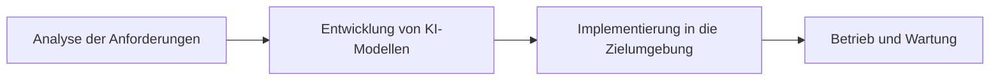
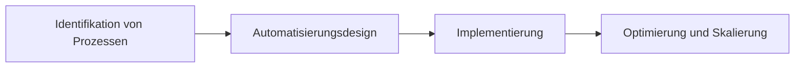
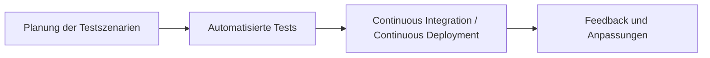
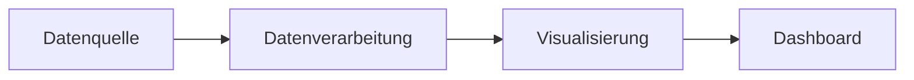
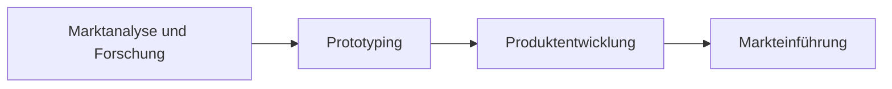

# Boiman Kupermann Solutions GmbH

## Willkommen bei Boiman Kupermann Solutions!

Wir sind Ihr Partner für die Digitalisierung und Automatisierung von Geschäftsprozessen, um zukunftssichere Lösungen zu schaffen. Mit unserer Expertise in KI, Prozessautomatisierung und Qualitätssicherung transformieren wir Ihre Geschäftsprozesse effizient und nachhaltig.

## Unsere Arbeitsweise

Bei Boiman Kupermann Solutions setzen wir auf fortschrittliche Technologien und innovative Ansätze zur Optimierung und Automatisierung von Geschäftsprozessen.

### Unser Projektvorgehen

Wir implementieren Lösungen durch ein **iteratives Vorgehen**, das sich über folgende Phasen erstreckt:

1. **Analyse**
   - Tiefgehende Dokumenten- und Prozessanalyse inkl. Merkmalsidentifikation.
2. **Entwicklung**
   - Auswahl und Entwicklung der maßgeschneiderten Modelle und Komponenten.
3. **Implementierung**
   - Bereitstellung und laufende Optimierung der trainierten Prototypen.
4. **Validierung & Optimierung**
   - Ergebnisvalidierung und Einbeziehung von Nutzerfeedback aus initialen Testläufen.
5. **Dokumentation & Übergabe**
   - Ausführliche Dokumentation und strukturierte Übergabe der fertigen Lösungen.

### Leistungsschwerpunkte

#### 1. Künstliche Intelligenz

- **Beschreibung**: Nutzung fortschrittlicher KI-Technologien und erprobter Methoden zur Integration von Sprachmodellen und anderen KI-Systemen in diverse Anwendungsgebiete.
- **Ziel**: Effiziente Automatisierung komplexer Aufgaben durch Künstliche Intelligenz, die operationalen und strategischen Mehrwert schafft.

#### 2. Prozessautomatisierung

- **Beschreibung**: Automatisierung sämtlicher technisch umsetzbarer Prozesse zur Effizienzsteigerung und Kostenreduktion.
- **Ziel**: Transformation und Digitalisierung von Geschäftsprozessen zur Steigerung der operativen Effizienz und zur Unterstützung skalierbarer Geschäftsmodelle.

#### 3. Qualitätssicherung

- **Beschreibung**: Sicherstellung der Softwarequalität durch kontinuierliche Integration und Deployment mittels CI/CD-Pipelines.
- **Ziel**: Hohe Produktqualität und schnelle Reaktionszeiten auf Änderungen sicherstellen, um agile Entwicklungsprozesse optimal zu unterstützen.

#### 4. Visualisierung & Dashboarding

- **Beschreibung**: Entwicklung übersichtlicher Dashboards zur klaren Darstellung von Ergebnissen und Leistungskennzahlen.
- **Ziel**: Verbesserte Entscheidungsfindung durch transparente und intuitive Datenvisualisierung, die kritische Insights auf einen Blick bietet.

#### 5. Produktentwicklung

- **Beschreibung**: Von der initialen Idee über Prototyping bis hin zur vollständigen Entwicklung und Markteinführung.
- **Ziel**: Schnelle Realisierung innovativer Produktideen von der Konzeption bis zur Kommerzialisierung durch strukturierte Entwicklungsprozesse.

## Wählen Sie uns für Ihren Wettbewerbsvorteil!

Unser Ziel ist es, durch innovative Lösungen und agile Methoden Ihre Geschäftsprozesse auf ein neues Level zu heben und Ihnen einen deutlichen Wettbewerbsvorteil zu verschaffen.

### Transparente Lösungen

Wir sorgen für maximale Transparenz in unseren Projekten durch klar strukturierte Dashboards und regelmäßige Updates, die den Fortschritt und die Ergebnisse jederzeit nachvollziehbar machen. Unsere interaktiven Tools ermöglichen es Ihnen, Anpassungen in Echtzeit zu verfolgen und zu steuern.

---

## Kontaktieren Sie uns für eine individuelle Beratung!

**Boiman Kupermann Solutions GmbH**

Email: [info@boiman-kupermann.com](mailto:info@boiman-kupermann.com)
